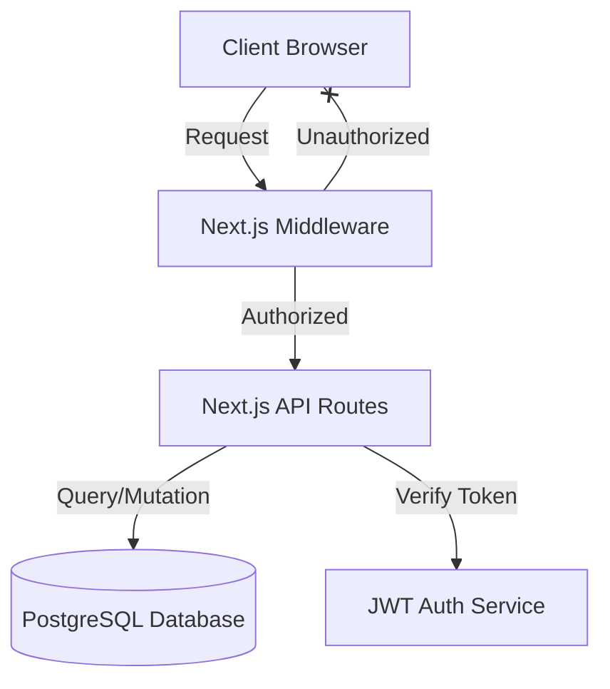

# Work Report Application - Technical Documentation

## 1. Executive Summary
The **Work Report Application** is an enterprise-grade solution for tracking employee daily activities, attendance, and leave status. It is built with a modern stack focusing on performance, type safety, and user experience. The system enforces strict role-based access control (RBAC) and includes specialized features for different organizational tiers (Employees, Managers, Admins, Board Members).

## 2. Architecture Overview

### High-Level Architecture
The application follows a monolithic Next.js architecture with server-side rendering (SSR) and API routes functioning as the backend.



### Technology Stack Details
| Layer | Technology | Key Libraries |
|-------|------------|---------------|
| **Frontend** | React 19, Next.js 16 | Radix UI, Tailwind CSS 4, Lucide React, Sonner (Toast) |
| **Backend** | Next.js API Routes | `jose` (JWT), `nodemailer` (Email) |
| **Database** | PostgreSQL | `drizzle-orm`, `pg` |
| **DevOps** | Docker | `next-pwa` (Progressive Web App) |

## 3. Database Schema & Relationships
The database is normalized and managed via Drizzle ORM.

### Key Entities
-   **Employees (`employees`)**: Central entity. Linked to `entities` (Company) and `branches`.
    -   *Roles*: `employee`, `manager`, `admin`, `superadmin`, `boardmember`.
    -   *Status*: `active` or `inactive`.
-   **Work Reports (`work_reports`)**: Daily submissions.
    -   Fields: `date` (text, YYYY-MM-DD), `status` (working, leave, absent), `workReport` (text), `onDuty` (bool), `halfday` (bool).
    -   *Constraint*: One report per employee per day.
-   **Organization**:
    -   `entities` (1) -> (N) `branches`
    -   `entities` (1) -> (N) `departments`
-   **Management**:
    -   `manager_departments`: Many-to-Many link between Managers and Departments they oversee.

## 4. Authentication & Security

### Middleware Architecture (`src/middleware.ts`)
The application uses edge-compatible middleware for strict security.
1.  **Route Protection**: Intercepts all requests to protected routes (e.g., `/admin`, `/employee-dashboard`).
2.  **JWT Verification**: Decodes the session cookie using `jose`. Checks for `active` status.
3.  **RBAC Enforcement**: checks `role` and `pageAccess` permissions against the requested route.
    -   *Example*: `/holidays` is accessible to Managers/Admins, but Operations employees need explicit `mark_holidays` permission.

### Environment Variables
The application requires the following configuration in `.env`:
-   `DATABASE_URL`: PostgreSQL connection string.
-   `JWT_SECRET` / `NEXTAUTH_SECRET`: Key for signing tokens.
-   `NEXT_PUBLIC_APP_URL`: Canonical URL.

## 5. API Reference
The backend logic is housed in `src/app/api`.

### Work Reports API
-   **GET `/api/work-reports`**
    -   Fetches reports for a specific employee.
    -   *Query Params*: `employeeId`, `startDate`, `endDate`.
-   **POST `/api/work-reports/submit`**
    -   Handles report submission.
    -   *Logic*: Can handle direct updates or asynchronous queue-based processing (returns `queueId`).

### Authentication API
-   **GET `/api/auth/session`**: Validates current session and returns user details.
-   **POST `/api/auth/login`**: Authenticates user against `employees` table (hashed passwords).

## 6. Component Deep Dive

### `WorkReportForm` (`src/components/work-report-form.tsx`)
A complex stateful form managing the daily reporting flow.
-   **State Machine**:
    1.  **Lookup**: Validation of Employee ID.
    2.  **Check**: Verifies if a report already exists for the selected date (`checkExistingReport`).
    3.  **Input**: Collects status (`working`, `leave`), `halfday`, `onDuty`, and report text.
    4.  **Submission**: Uses polling mechanism for queued submissions.
-   **Validation**: Prevents future dates (IST validation). Enforces "Work Report" text for "Working" status.

### `WorkReportCalendar` (`src/components/work-report-calendar.tsx`)
A visualization component for report history.
-   **Visual Language**:
    -   🟩 **Green**: Working
    -   🟨 **Yellow**: Half Day
    -   🟧 **Orange**: Leave
    -   🟥 **Red**: Not Submitted / Absent
    -   **Diagonal Splits**: CSS clipping masks used to show combinations like "Working + On Duty" (Green/Blue split).
-   **Logic**: Auto-calculates Sundays and Holidays to distinguish them from missing reports.

## 7. Operational Workflows

### Report Submission Flow
1.  User enters Employee ID (auto-filled if logged in).
2.  System validates ID and checks for existing report on selected date.
3.  User fills details.
    -   *Constraint*: Cannot submit for future dates.
4.  User hits "Submit".
    -   API processes request.
    -   Frontend polls for completion if queued.
5.  Success message shown with animation.

### Attendance Marking (Operations)
Specialized flow for Operations department.
-   Route: `/mark-attendance`
-   Permission: Requires `pageAccess.mark_attendance = true`.
-   Function: Allows bulk marking or specific overrides for other employees.

## 8. Deployment Manual

### Docker Deployment
The app is containerized for production.
```yaml
# docker-compose.production.yml
services:
  app:
    build:
      context: .
      dockerfile: Dockerfile
    environment:
      - DATABASE_URL=...
      - NODE_ENV=production
    ports:
      - "3000:3000"
```

### Manual Build
```bash
# 1. Install
npm install

# 2. Generate Database Client
npm run db:generate

# 3. Build Application
npm run build

# 4. Start Server
npm run start
```
